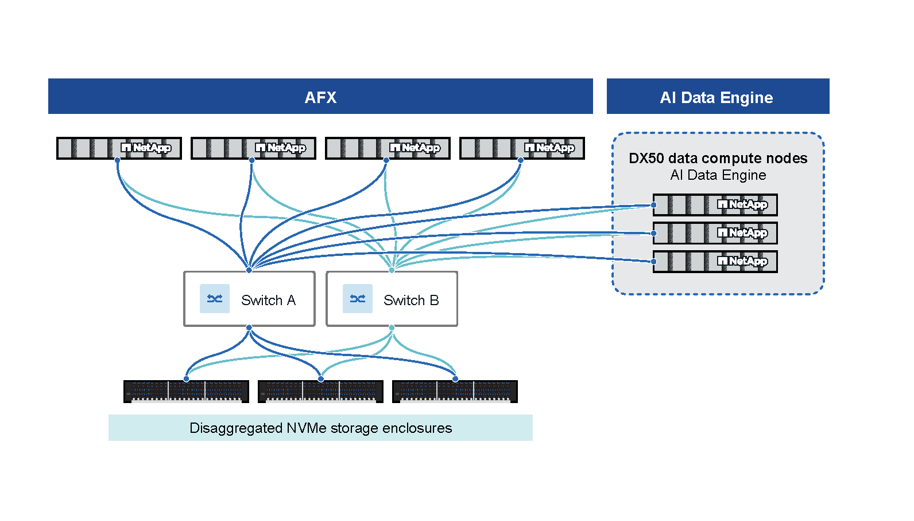

= AI Data Engine high-level architecture
:icons: font
:imagesdir: ../media/

[.lead]
AIDE is built on a scalable, fault-tolerant architecture that separates storage and compute, enabling high performance and flexibility for AI workloads.

== Physical components

=== AFX controller nodes

AFX controller nodes run a specialized personality of the ONTAP software designed to support the requirements of the AFX environment. Clients access the nodes through multiple protocols, including NFS, SMB, and S3. Each node has a complete view of the storage, which it can access based on the client requests. The nodes are stateful with non-volatile memory to persist critical state information and include additional enhancements specific to the target workloads.
//shared AFX text

=== Data compute nodes (DCNs)

DCNs are Linux-based servers with high CPU, RAM, and GPU resources, dedicated to AI data processing tasks. They host AI-specific services such as metadata cataloging, vector search, and embedding pipelines.

=== Cluster/storage switches

Redundant, high-speed (100GbE or higher) switches connect ONTAP and DCN nodes for low-latency data transfer and high availability.

=== Storage shelves

NVMe-oF shelves with high-density SSDs provide ultra-low latency and redundancy, supporting PB-scale storage.

== Networking

All Data Compute Nodes (DCNs) and ONTAP storage nodes are connected through redundant, high-speed cluster switches (minimum 100GbE). This architecture separates compute and storage resources, allowing each to scale independently and optimizing both performance and resource utilization.

Networking between DCNs and ONTAP nodes is isolated using dedicated VLANs and IPspaces on the cluster switches. This ensures that all communications, such as data access, management APIs, and internal service traffic, remain secure, efficient, and do not interfere with other network operations.

== Security and multi-tenancy

The platform enforces both role-based access control (RBAC) and resource-level access control lists (ACLs). All API and user actions are audited, and all data is encrypted at rest and in transit. Single tenants are isolated for data and metadata.

== AI Data Engine primary features

The AI Data Engine (AIDE) primary features work together to automate, secure, and accelerate the AI data lifecycle. Each feature is implemented as a set of microservices running on data compute nodes (DCNs), integrated with ONTAP storage, and exposed through REST APIs and management interfaces.

=== Metadata Engine

The Metadata Engine automatically generates a structured, up-to-date, and interactive view of your NetApp data estate. 

The MetaData Engine is included with the base ONTAP One license and is available upon AIDE installation.

You can access it through System Manager.

.Capabilities

* Centralized metadata cataloging for all data sources (local and remote ONTAP volumes).
* Automated metadata extraction and catalog population as new data is ingested or changed.
* REST APIs for querying metadata, enabling data practitioners and storage admins to collaboratively discover, classify, and understand data.
* Significant reduction in NFS traffic load on storage systems by offloading metadata queries from the data path.
* Support for large metadata records, with robust indexing and search capabilities.
* Integration with workspace and data collection abstractions, allowing fine-grained access control and governance.

=== Data Sync

Data Sync ensures that the metadata catalog and data collections remain current and consistent with the underlying data sources, even as source data changes.

Data Sync is not included with the base ONTAP One license and requires a separate AIDE license.
//need link to license docs

.Capabilities

* Automated, policy-driven synchronization of data from remote or local ONTAP clusters using SnapMirror.
* Efficient, incremental updates using SnapDiff to detect and propagate only changed data.
//need link to SnapDiff docs
* Secure, incremental data mobility and sync across the data estate, eliminating redundant copies and reducing storage costs.
* Scheduling and monitoring of sync intervals, with configurable refresh rates for each workspace.
* Integration with workspace creation workflows, so that metadata is always extracted and updated as new data sources are added.

=== Data Guardrails

Data Guardrails provide continuous, automated governance and protection for sensitive data throughout the AI lifecycle. 

Data guardrails is not included with the base ONTAP One license and requires a separate AIDE license.
//need link to guardrails and license docs

You can access guardrail functionality through the AI Data Engine Console. 

.Capabilities

* Continuous scanning, classification, and categorization of data across hybrid cloud environments.
* Identification of sensitive data and risks, leveraging built-in and customizable classifiers for such tasks as PII detection.
* Policy-driven automation for handling sensitive data, including redaction, masking, and access restrictions.
* Enforcement of company and regulatory standards through guardrail policies attached to workspaces.
* The ability to restrict access to sensitive files or entire volumes as necessary, with audit logging and compliance reporting.
* Integration with workspace and data collection management, so that guardrails are applied consistently across all AI data workflows.

=== Data Curator

The Data Curator service enables fast, frictionless data discovery, search, vectorization, and retrieval for AI and GenAI applications. 

Data curator is provided as separate supplemental software update.
//need link to curator docs

You can access Data Curator through the AI Data Engine Console.

.Capabilities

* Powerful search across hybrid cloud storage for relevant data, leveraging the centralized metadata catalog.
* Tools for data scientists to easily create curated data collections with current data.
* Automated generation of vector embeddings at the storage layer, reducing data bloat and optimizing both cost and performance.
* A secure retrieval endpoint for AI applications, enabling rapid vector semantic search and re-ranking.
* Integration with popular AI tools and technologies, including direct support for Retrieval-Augmented Generation (RAG) pipelines and agentic AI frameworks.
* REST APIs for programmatic access to data collections, vector search, and retrieval endpoints

== Role-based interaction with AIDE components

Each AIDE user (storage administrators, data engineers, and data scientists) interact with different AIDE component depending on their role.

=== Workspaces
A workspace is a logical segment of data within the cluster, grouping volumes and buckets for a specific project, team, or workflow. Workspaces define the scope of data visibility, access, and governance in AIDE.

.How each role uses it

* Storage administrator: Creates and manages workspaces using ONTAP System Manager. Selects which data sources are included, assigns permissions to data engineers and data scientists, and attaches guardrail policies to enforce governance and compliance. Monitors workspace health and access.
* Data engineer: Receives access to assigned workspaces. Uses the AI Data Engine Console to explore, query, and understand available data sources. Builds data collections from workspace data and manages data pipelines.
* Data scientist: Receives access to workspaces relevant to research or modeling tasks. Uses the AI Data Engine Console to search for and understand available data, focusing on files and objects needed for analysis or model training.

=== Data collections
A data collection is a curated group of related files or objects from a workspace, assembled for a specific AI workflow, experiment, or model training task. Data collections can be static (point-in-time) or dynamic (reflecting ongoing changes).

.How each role uses it

* Storage administrator: Views the status and health of data collections within each workspace using System Manager. Ensures underlying data sources are available and protected, but does not create or modify collections.
* Data engineer: Creates and manages data collections by querying the workspace's metadata catalog in the AI Data Engine Console. Filters data by tags, classification, or other attributes. Manages lifecycle, retention, and governance policies for collections. Publishes collections as RAG endpoints for AI/ML use.
* Data scientist: Selects and uses data collections for experiments, model training, or inference. Annotates, versions, or refines collections as analysis progresses. Uses collections as the basis for semantic search and GenAI workflows.

=== Vector database
The vector database stores embeddings generated from data collections, enabling high-performance semantic search and retrieval for AI and GenAI applications.

.How each role uses it

* Storage administrator: Provisions and monitors the vector database infrastructure, ensuring data compute nodes with GPU resources and proper licensing are in place. Supports the environment but does not manage embeddings or queries directly.
* Data engineer: Triggers embedding pipelines for data collections, selects models and parameters, and monitors vectorization status in the AI Data Engine Console. Uses APIs to perform semantic search and integrates retrieval endpoints into AI applications.
* Data scientist: Uses semantic search APIs to find relevant data in collections, leveraging embeddings generated by data engineers or automated pipelines. Integrates retrieval endpoints into GenAI or RAG workflows for context-aware model responses.

=== Guardrails
Guardrails are policy-driven mechanisms that enforce data governance, classification, and protection (such as redaction or access restrictions) throughout the AI data lifecycle.

.How each role uses it
* Storage administrator: Defines and attaches guardrail policies to workspaces using System Manager. Monitors guardrail status and compliance reports. Ensures policies are enforced and updated as needed.
* Data engineer: Works within the guardrails attached to workspaces and data collections. May request changes to guardrail policies for workflow needs but cannot override them. Guardrails ensure compliant and secure data processing.
* Data scientist: Operates within the constraints of guardrails attached to workspaces and data collections. Relies on guardrails for automated classification, redaction, and protection of sensitive data, ensuring compliance without manual intervention.

=== Metadata catalog
A centralized, scalable database storing metadata records for all files and objects across local and remote ONTAP clusters. Enables rich, interactive search and filtering.

.How each role uses it
* Storage administrator: Ensures the metadata catalog is populated and up-to-date. Monitors catalog health and supports access control.
* Data engineer: Uses the metadata catalog in the AI Data Engine Console to discover, filter, and understand data sources before building data collections. Runs queries to identify relevant files and objects.
* Data scientist: Uses the metadata catalog to search for and understand available data, focusing on files and objects needed for analysis or model training.

=== Retrieval endpoint (RAG endpoint)
A secure API endpoint that enables AI and GenAI applications to retrieve relevant data, context, or embeddings from curated collections and the vector database.

.How each role uses it
* Storage administrator: Supports and monitors the infrastructure that enables retrieval endpoints, ensuring security and performance.
* Data engineer: Publishes data collections as RAG endpoints, configuring chunking and embedding parameters. Manages RBAC access and provides endpoint details for integration with AI applications.
* Data scientist: Uses retrieval endpoints to power GenAI and RAG workflows, enabling models to connect to data and provide context-aware responses.

=== Classifiers

Classifiers are tools (built-in or custom) that scan and tag files for specific types of sensitive data (for example, PII, financial, healthcare) or categorize documents by type (for example, legal, HR, sales).

.How each role uses it
* Storage administrator: Creates, configures, and manages classifiers and their categories. Applies classifiers to workspaces and monitors their effectiveness.
* Data engineer: Applies classifiers to data collections, reviews classification results, and uses them to filter or annotate data for AI workflows.
* Data scientist: Benefits from pre-classified data, ensuring that only compliant and relevant data is used in analysis and modeling.

== User interfaces and APIs

AIDE provides these interfaces for user interaction and automation:

=== ONTAP System Manager

ONTAP System Manager is a web-based interface designed for storage administrators. It provides workflows for cluster setup, workspace management, DCN node monitoring, and attaching guardrail policies. 

.How each role uses it

* Storage administrator: Uses System Manager to configure infrastructure, assign roles, and monitor health and compliance.
* Data engineer: Does not use System Manager for their workflows.
* Data scientist: Does not use System Manager for their workflows.

=== AI Data Engine Console

The AI Data Engine Console is a dedicated interface for data engineers and data scientists. It enables users to explore data sources, create and manage data collections, configure data pipelines, apply classifiers, and interact with guardrails and vector search features. The Console provides advanced tools for data discovery, curation, and integration with AI/ML workflows.

.How each role uses it

* Storage administrator: Typically does not use this interface.
* Data engineer: Uses the AI Data Engine Console for day-to-day tasks including data discovery, collection management, and pipeline configuration.
* Data scientist: Uses the AI Data Engine Console for day-to-day tasks including data exploration, curation, and integration with AI/ML workflows.

=== REST API

AIDE exposes REST APIs for automation, integration, and programmatic access. The API supports cluster setup, workspace and collection management, metadata queries, vector search, and retrieval endpoints. 

.How each role uses it

* Storage administrator: Uses the API for automation and programmatic cluster setup, workspace management, and monitoring.
* Data engineer: Uses the API for automation of data workflows, collection management, metadata queries, and integration with external tools.
* Data scientist: Uses the API for programmatic access to data collections, vector search, retrieval endpoints, and integration with AI/ML applications.

== Roles and component access

[cols="2h,2,2,2", options="header"]
|===
|Component
|Storage administrator
|Data engineer
|Data scientist

|System Manager
|Manage
|No access
|No access

|AI Data Engine Console
|No access
|Manage
|Manage

|REST API
|Manage
|Manage
|Manage

|Workspaces
|Manage
|View/use
|View/use

|Data collections
|View only
|Manage
|Manage

|Guardrails
|Attach/view policies
|View/enforce
|View/enforce

|Metadata catalog
|Monitor
|Query/use
|Query/use

|Vector database
|Provision/monitor
|Manage embeddings/search
|Use search

|Classifiers
|Manage
|Apply/review
|Use

|===

[NOTE]
====
Manage: Create, edit, and delete resources.

View: Read-only access to resources.

Attach: Assign existing policies to resources.

Provision: Deploy and configure infrastructure.

Monitor: View health, status, and activity.

Use: Consume for AI/ML workflows.

Apply: Use existing classifiers.

Enforce: Operate within assigned policies.
====