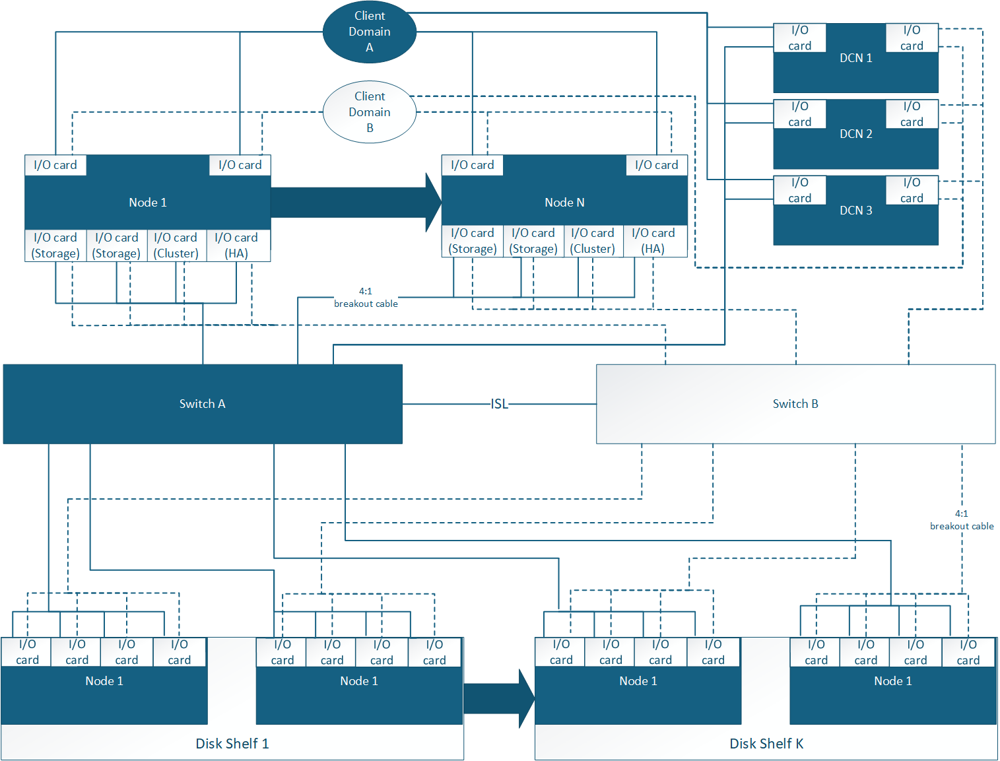

= Supported configurations for your AIDE storage system
:icons: font
:imagesdir: ../media/

[.lead]
Learn about the supported hardware components and cabling options for the AI Data Engine, including compatible data compute nodes, controller nodes, storage disk shelves, switches, and cable types required for proper system setup.

== Supported AIDE cabling configuration
Data compute nodes for the AI Data Engine are configured within an AFX storage system. The initial configuration of the AIDE system supports a minimum of three data compute nodes for a cluster.

Additional data compute nodes can be used to expand on the initial AIDE configuration. Expanded AIDE configurations follow the same switch-based cabling methodology as the schema depicted below.

== Supported hardware components
Review the compatible data compute nodes, controller nodes, disk shelves, switches, and cable types for the AIDE system.

[cols="2,2,2,3,6",options="header"]
|===
a| *Date Compute Node* a| *Controller Shelf* a| *Disk Shelf* a| *Supported Switches* a| *Supported Cables*
a|
DX50
a|
AFX 1K
a|
NX224
a|
* Cisco Nexus 9332D-GX2B (400GbE)
* Cisco Nexus 9364D-GX2A (400GbE)
a|
* 400GbE QSFP-DD breakout to 4x100GbE QSFP56 cables
+
NOTE: Breakout cables are used for 100GbE connections between the switches, controllers, and disk shelves. 
+
** 100GbE cables to controller cluster and HA ports
** 100GbE cables to disk shelves
* 2 x 400GbE QSFP-DD cables for ISL connections between switch A and switch B 
* RJ-45 cables for management connections
|===

.What's next?
After reviewing the supported system configuration and hardware components, link:install-network-reqs.html[review the network requirements for your AIDE system].
