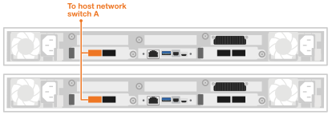
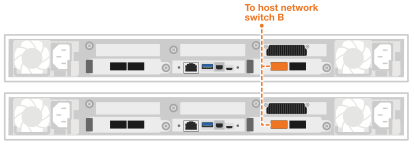
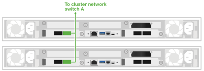
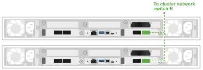

= Cable the hardware for your DX50 data compute nodes
:icons: font
:imagesdir: ../media/

[.lead]
Connect your DX50 data compute nodes to the host network and cluster network switches to enable AI workload processing and integration with your AFX 1K storage system. This procedure uses 100GbE connections for both host network access and cluster communication, allowing the DX50 nodes to leverage the existing cluster infrastructure without powering down the AFX system.

.Before you begin

* You have an existing AFX 1K storage system installed. For information on installing the AFX 1K storage system, refer to link:https://docs.netapp.com/us-en/ontap-afx/install-setup/install-setup-workflow.html[install your AFX 1K storage system^].
* You have the required network switches installed and configured.Contact your network administrator for information about connecting the system to your network switches.
* You have reviewed the link:https://docs.netapp.com/us-en/ai-data-engine/install-setup/cable-overview.html[cabling requirements for the DX50 data compute nodes^].

.About this task
These procedures show common configurations. The specific cabling depends on the components ordered for your storage system. For comprehensive configuration details and slot priorities, see link:https://hwu.netapp.com[NetApp Hardware Universe^].

NOTE: You do not need to power off the AFX 1K storage system when cabling the DX50 data compute nodes. You can add the DX50 data compute nodes to an existing AFX 1K storage system that is already powered on and configured. 

== Step 1: Connect the data compute nodes to the host network
You can connect the data compute node ports to your host network. 

NOTE: Take care when clicking the delicate connector components into place.

.Steps

. Connect the following data compute node ports to Ethernet data network switch A:
* Data Compute Node 1
** e4b
* Data Compute Node 2
** e4b
+
*100GbE cables*
+
image::../media/oie_cable100_gbe_qsfp28.png[100 Gb Ethernet cable]
+

. Connect the following data compute node ports to Ethernet data network switch B:
* Data Compute Node 1
** e5b
* Data Compute Node 2
** e5b
+
*100GbE cables*
+
image::../media/oie_cable100_gbe_qsfp28.png[100 Gb Ethernet cable]
+

== Step 2: Cable the data compute node cluster connections
Data compute nodes use the e4a/e5a ports for cluster connections. 

.Steps
. Connect the following data compute node ports to a non-ISL port on cluster network switch A:
* Data Compute Node 1
** e4a
* Data Compute Node 2
** e4a
+
*100GbE cables*
+
image::../media/oie_cable100_gbe_qsfp28.png[100 Gb Ethernet cable]
+

. Connect the following data compute node ports to a non-ISL port on cluster network switch B:
* Data Compute Node 1
** e5a
* Data Compute Node 2
** e5a
+
*100GbE cables*
+
image::../media/oie_cable100_gbe_qsfp28.png[100 Gb Ethernet cable]
+

.What's next?

After you’ve cabled the hardware, you link:power-on-hardware.html[power on your DX50 data compute nodes].
