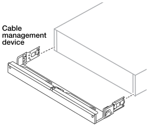

= Install your AIDE storage system
:icons: font
:imagesdir: ../media/

[.lead]
After you install the switches, you should install the hardware for your AIDE system. First, install the rail kits. Next, install and secure your data compute nodes and storage system in a cabinet.

.Before you begin

* Make sure you have the instructions packaged with the rail kit.

* Be aware of the safety concerns associated with the weight of the data compute node, controller, and storage shelf.

* Understand that the airflow through the system enters from the front where the bezel or end caps are installed and exhausts out the rear where the ports are located.

.Steps

. Install the rail kits for your storage system and storage shelves, as needed, using the instructions included with the kits.

. Install and secure your controller in the cabinet:

.. Position the storage system onto the rails in the middle of the cabinet, and then support the system from the bottom and slide it into place.

.. Secure the system to the cabinet using the included mounting screws.

+
. Attach the bezel to the front of the controller.
+
. If your storage system came with a cable management device, attach it to the rear of the storage system.
+

+
. Install and secure the storage shelf:
+

.. Position the back of the storage shelf onto the rails, and then support the shelf from the bottom and slide it into the cabinet. 
+
In general, the switches should be installed in the center of the cabinet. The storage shelves should be installed below the switch and above a second installed switch. The controller nodes can be installed above or below the switches within the cabinet. Data compute nodes can be installed above or below the controller nodes within the cabinet.

.. Secure the storage shelf to the cabinet using the included mounting screws.

.What's next?
After you've installed the hardware for your AIDE system, review the link:afx-cable-overview.html[supported cabling configurations for your AIDE system].

// 2024 Sept 23, ONTAPDOC 1922