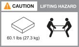

= Installation requirements for AIDE systems
:icons: font
:imagesdir: ../media/

[.lead]
Review the equipment needed and the lifting precautions for your AIDE data compute nodes. storage controller, and storage shelves.

== Equipment needed for install
To install your AIDE system, you need the following equipment and tools. 

** Access to a Web browser to configure your storage system
** Electrostatic discharge (ESD) strap 
** Flashlight
** Laptop or console with a USB/serial connection
** Paperclip or narrow tipped ball point pen for setting storage shelf IDs
** Phillips #2 screwdriver 

== Lifting precautions 
The storage controller, data compute node, and storage shelves are heavy. Exercise caution when lifting and moving these items.

=== AIDE data compute node weights 
Take the necessary precautions when moving or lifting your AIDE data compute node.

An AIDE data compute node can weight up to 46.3 lbs (21Kg). To lift the data compute node, use two people or a hydraulic lift.

=== Storage controller weights
Take the necessary precautions when moving or lifting your storage controller.

An AIDE-compatible AFX 1K storage controller can weigh up to 62.83 lbs (28.5 kg). To lift the storage controller, use two people or a hydraulic lift.

image::../media/drw_a1k_weight_caution_ieops-1698.svg[AFK 1K lifting caution icon]

=== Storage shelf weights
Take the necessary precautions when moving or lifting your shelf.

.NX224 shelf
--

An NX224 shelf can weigh up to 60.1 lbs (27.3 kg). To lift the shelf, use two people or a hydraulic lift. Keep all components in the shelf (both front and rear) to prevent unbalancing the shelf weight.

.Related information

*  https://library.netapp.com/ecm/ecm_download_file/ECMP12475945[Safety information and regulatory notices^]

.What's next?
After you've reviewed the hardware requirements, you link:prepare-hardware.html[prepare to install your AIDE system].

// 2024 Sept 23, ONTAPDOC 1922
