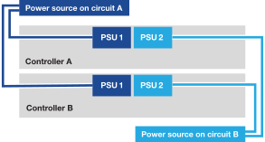

= Power on your data compute nodes for AI Data Engine
:icons: font
:imagesdir: ../media/

[.lead]
After you install the rack hardware and cable your data compute nodes, you should power on your DCNs and your controller nodes for the AFX storage system if not already powered on.

.Before you begin
* Make sure that your shelves are powered on and each assigned a unique shelf ID. For information on assigning shelf IDs for the AFX storage system, see the link:https://docs.netapp.com/us-en/ontap-afx/install-setup/power-on-hardware.html#step-1-power-on-the-shelf-and-assign-shelf-id[documentation about assigning unique shelf IDs^].

.Steps
After you've turned on your storage shelves and assigned the unique IDs, power on your DCNs and power on the storage controller nodes if they are not already powered on.

. Connect your laptop to the serial console port. This allows you to monitor the boot sequence when the controllers are powered on.

.. Set the serial console port on the laptop to 115,200 baud with N-8-1.
+
See your laptop's online help for instructions on how to configure the serial console port.

..  Connect the console cable to the laptop, and connect the serial console port on the controller using the console cable that came with your storage system.
 
.. Connect the laptop to the switch on the management subnet.
+
image::../media/drw_afx_1k_console_connection_ieops-2708.svg[Console connections]

[start=2]

. Assign a TCP/IP address to the laptop, using one that is on the management subnet.
+
. Plug the power cords into the controller power supplies, and then connect them to power sources on different circuits.
+

+
* The system begins to boot. Initial booting may take up to eight minutes. 
+
* The LEDs flash on and the fans start, which indicates that the controllers are powering on.
+
* The fans may be noisy at start-up, which is normal.

[start=4]
. Plug the power cords into the data compute node power supplies, and then connect them to power sources on different circuits.
. Secure the power cords using the securing device on each power supply.
. Power on the data compute nodes.
+
You might have to remove the bezel to access the power switch; if so, remember to reinstall it afterwards.

.What's next?
After you've turned on your data compute nodes, link:../install-setup/cluster-setup-afx.html[set up an ONTAP AIDE cluster].